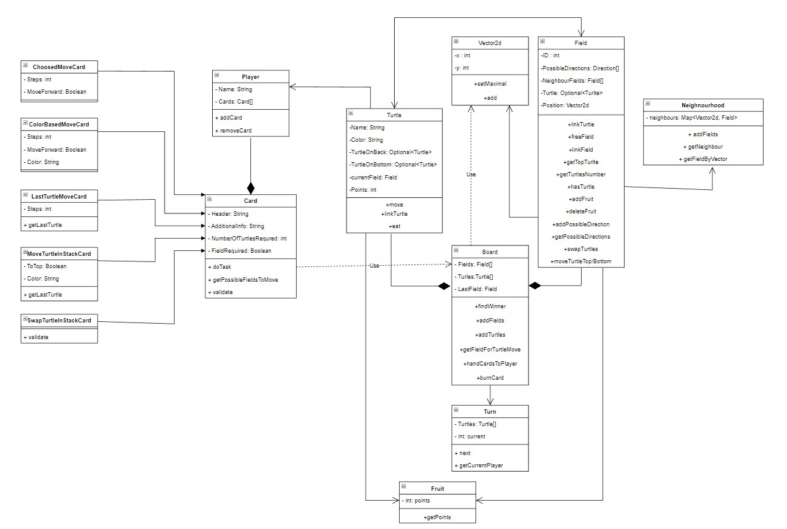

# Technologie Obiektowe - projekt

- Mateusz Mazur
- Wojciech Łącki
- Mikołaj Klimek

## Milestone 3
### Model
Zaktualizowany diagram klas modelu


- **Klasa Vector2d** używana jest do określania pozycji pól na mapie.
- **Klasa Turtle** reprezentuje żółwia, wraz z nickiem użytkownika oraz liczbą punktów, a także wskaźniki na opcjonalne żółwie, które mogą znajdować się nad lub pod tym konkretnym żółwiem. Liczba punktów żółwia może być aktualizowana po dojściu do mety lub zjedzeniu owocu.
- **Klasa Field** reprezentuje pojedyncze pole, na którym przebywać mogą żółwie, przechowuje informacje o polach sąsiadów, do które żółwie mogą przechodzić oraz o owocu, który żółwie mogą zjeść .
- **Klasa Neigbourhood** reprezentuje  mapę odwzorowującą połączenie pola z sąsiadami na podstawie kierunku (**Direction**  - ENUM).
- **Klasa Fruit** reprezentuje owoce zjadane przez żółwie, każdy owoc ma przypisaną liczbę punktów.
- **Klasa Board** reprezentuje planszę, na której toczy się gra, zawiera listę żółwi i pól oraz wskazanie mety, pozwala zakończyć rozgrywkę po osiągnięciu mety, korzystając z warstwy persystencji zapewnia zapis do bazy danych.
Board wczytuje nieliniową planszę z pliku, co jest możliwe dzięki klasie **MapParser**.
- **Klasa Turn** reprezentująca turę, dzięki której możliwe jest określenie tego, który gracz ma wykonać ruch.
- **Klasa Player** reprezentuje gracza i posiada przypisane kart, których może on używać.
- **Abstrakcyjna klasa Card** reprezentuje kartę, której mogą używać gracze do przemieszczania się po planszy i zmieniania kolejności żółwi znajdujących się na stosie. 
Każda karta posiada opis oraz określone wymagania, pomocnicze funkcje oraz właściwą funkcję, która realizuje jej zadanie.
W puli dostępne są następujące karty:
  - ***ChoosedMoveCard*** *poruszająca wybranym przez gracza żółwiem o określoną liczbę pól.*
  - ***ColorBasedMoveCard*** *poruszająca żółwiem w określonym kolorze o określoną liczbę pól.*
  - ***LastTurtleMoveCard*** *poruszająca będącym najbliżej startu żółwiem o określoną liczbę pól.*
  - ***MoveTurtleInStackCard*** *przesuwająca żółwia o określonym kolorze na szczyt lub spód stosu.*
  - ***SwapTurtleInStackCard*** *zamieniająca miejscami dwa wybrane przez użytkownika żółwie na tym samym stosie.*

#### Format pliku, z którego wprowadzane są dane dotyczące mapy
Każde pojedyncze pole reprezentowane jest przez wiersz:
```
<współrzędna_x>:<współrzędna_y>|<kierunek_naprzód>,<kierunek_naprzód>...;<kierunek_wstecz>,<kierunek_wstecz>...|<punkty_owocu>
```
Pierwsze pole pliku uznawane jest za pole startowe, a ostatnie za metę. Przykładowe mapy dodano w folderze ./resources/map.

### Widoki
Za wygląd aplikacji odpowiedzialne są pliki FXML przechowywane w katalogu ./resources/view oraz powiązane z nimi kontrolery.
- **GameSettings** - ekran z wstępnymi ustawieniami - liczbą żółwi i rozmiarem planszy.
- **PlayersSettings** - ekran pobierający dane o graczach - nicki i wybrane kolory.
- **BoardController** - ekran z planszą, po której poruszają się żółwie w czasie gry oraz na której wyświetlają się karty posiadane przez danego gracza.
- **PlayerData** - ekran wyświetlający nick gracza, który obecnie wykonuje ruch.
- **EndGame** - ekran przedstawiający wyniki po zakończeniu rozgrywki.


Klasa **App** uruchamia pierwszy widok.

Wczytywanie plików FXML ułatwia klasa **FXMLLoaderProvider**.

### Persistence
Zawiera klasy pozwalające na zapis obiektów do bazy danych. W aplikacji zapisywane są logi z podsumowaniem gier po zakończeniu rozgrywki. Zawierają one liczbę graczy oraz pól, pseudonim i ilość punktów zwycięzcy oraz datę. Do reprezentowania logów stworzona została osobna klasa **GameLog.** 

Aby umożliwić zapis do bazy wykorzystany został interfejs **GameLogRepository** rozszerzający JpaRepository ze Spring Boot.

### Testy
W **TurtlesApplicationTests** zaimplementowane zostały testy sprawdzające poprawność łączenia pól, dołączania żółwi do pól oraz zapisy logów gier do bazy danych.

Po dodaniu odpowiedniej funkcjonalności do aplikacji, **TurtlesApplicationTests** wzbogacona została również o testy sprawdzające poprwaność określania sąsiednich pól na nieliniowej mapie, operacje w klasie Vector2d oraz funkcje związane ze zjadaniem owoców przez żółwie, w tym również przy wprowadzeniu wielu żółwi na pole.

Po wprowadzeniu funkcjonalności kart dodane zostały testy sprawdzające związane z nimi funkcje, między innymi zmianę tury, przesuwanie żółwi na stosie oraz przyporządkowanie kart do graczy.